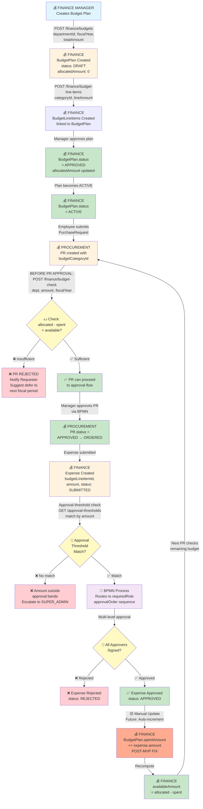
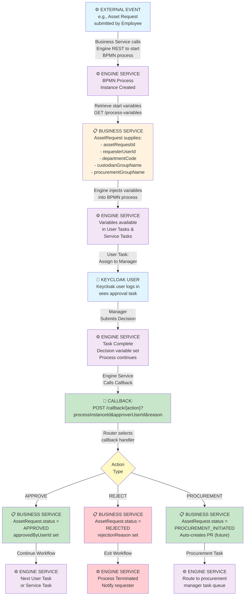

# Werkflow ERP - Critical Flow Diagrams

## 1. Asset Lifecycle Flow

```mermaid
graph TD
    A["🧑 EMPLOYEE<br/>Submits Asset Request"] -->|POST /inventory/asset-requests<br/>procurementRequired=true| B["📋 INVENTORY<br/>AssetRequest Created<br/>status: PENDING"]

    B -->|POST /asset-requests/{id}/<br/>process-instance| C["⚙️ ENGINE SERVICE<br/>BPMN Process Started<br/>Variables: assetRequestId,<br/>departmentCode,<br/>custodianGroupName"]

    C -->|User Task:<br/>Manager Reviews| D{"✅ Manager<br/>Decision"}

    D -->|APPROVE| E["📋 INVENTORY<br/>AssetRequest.status<br/>= APPROVED"]
    D -->|REJECT| F["❌ INVENTORY<br/>AssetRequest.status<br/>= REJECTED<br/>🔴 END FLOW"]

    E -->|Procurement Flag<br/>procurementRequired=true<br/>Callback| G["📋 INVENTORY<br/>AssetRequest.status<br/>= PROCUREMENT_INITIATED"]

    G -->|POST /procurement/<br/>purchase-requests<br/>include budgetCategoryId| H["💰 PROCUREMENT<br/>Purchase Request Created<br/>status: DRAFT"]

    H -->|POST /finance/budget-check<br/>Request: dept, amount,<br/>fiscalYear| I{"💵 Budget<br/>Available?"}

    I -->|❌ NO| J["❌ PR REJECTED<br/>Notify Requester<br/>🔴 END FLOW"]
    I -->|✅ YES| K["💰 PROCUREMENT<br/>PR.status =<br/>PENDING_APPROVAL"]

    K -->|Manager Approval<br/>via BPMN| L["💰 PROCUREMENT<br/>PR.status = APPROVED"]

    L -->|POST /procurement/<br/>purchase-orders<br/>vendorId, prId| M["💰 PROCUREMENT<br/>Purchase Order Created<br/>PO.status: CONFIRMED"]

    M -->|Vendor Delivers| N["📦 LOGISTICS<br/>Goods in Transit"]

    N -->|POST /procurement/<br/>receipts<br/>poId, acceptedQty| O["💰 PROCUREMENT<br/>Receipt Created (GRN)<br/>status: COMPLETE"]

    O -->|🟡 Manual Step<br/>Future: Webhook| P["📊 INVENTORY<br/>AssetInstance Created<br/>status: AVAILABLE<br/>assetTag assigned"]

    P -->|POST /custody-records<br/>assetId, custodianDeptId,<br/>custodianUserId| Q["📊 INVENTORY<br/>CustodyRecord Created<br/>status: ACTIVE<br/>AssetInstance.status: IN_USE"]

    Q -->|Asset needs<br/>relocation| R["📊 INVENTORY<br/>TransferRequest Created<br/>fromDeptId → toDeptId"]

    R -->|Manager Approves| S["📊 INVENTORY<br/>Transfer.status =<br/>COMPLETED<br/>Old Custody ended<br/>New Custody created"]

    Q -->|Maintenance<br/>Scheduled| T["📊 INVENTORY<br/>MaintenanceRecord<br/>Created<br/>status: SCHEDULED"]

    T -->|Service completed| U["📊 INVENTORY<br/>MaintenanceRecord<br/>status: COMPLETED<br/>nextMaintenanceDate set"]

    style A fill:#e1f5ff
    style B fill:#fff3e0
    style C fill:#f3e5f5
    style E fill:#c8e6c9
    style F fill:#ffcdd2
    style H fill:#fff3e0
    style I fill:#fff9c4
    style J fill:#ffcdd2
    style K fill:#c8e6c9
    style M fill:#fff3e0
    style O fill:#c8e6c9
    style P fill:#fff3e0
    style Q fill:#c8e6c9
    style T fill:#fff3e0
    style U fill:#c8e6c9
```

---

## 2. Budget Approval Flow



---

## 3. Procurement Flow (PR → PO → Receipt → Inventory)

```mermaid
graph TD
    A["📋 PROCUREMENT<br/>Team Creates<br/>Purchase Request"] -->|POST /purchase-requests<br/>requestingDeptId,<br/>lineItems[budgetCategoryId]| B["💰 PROCUREMENT<br/>PR Created<br/>prNumber: PR-{ts}<br/>status: DRAFT"]

    B -->|BEFORE APPROVAL:<br/>POST /finance/budget-check| C{"💵 Budget<br/>Gate"}

    C -->|❌ FAILED| D["❌ PR REJECTED<br/>Can't proceed"]
    C -->|✅ PASSED| E["✅ PR APPROVED<br/>status: PENDING_APPROVAL"]

    E -->|Manager Approval| F["💰 PROCUREMENT<br/>PR.status =<br/>APPROVED"]

    F -->|POST /purchase-orders<br/>vendorId,<br/>purchaseRequestId| G["💰 PROCUREMENT<br/>PO Created<br/>poNumber: PO-{ts}<br/>status: DRAFT"]

    G -->|Line items added<br/>from PR| H["💰 PROCUREMENT<br/>PoLineItems Created<br/>prLineItemId ref"]

    H -->|Manager confirms| I["💰 PROCUREMENT<br/>PO.status =<br/>CONFIRMED"]

    I -->|PO sent to vendor| J["📦 VENDOR<br/>Processes Order"]

    J -->|Goods shipped| K["📦 LOGISTICS<br/>In Transit"]

    K -->|POST /receipts<br/>poId, lineItems<br/>receiveQty, condition| L["💰 PROCUREMENT<br/>Receipt Created (GRN)<br/>receiptNumber: GR-{ts}"]

    L -->|Goods inspected<br/>Quality Check| M["🔍 QC PROCESS<br/>acceptedQty vs<br/>rejectedQty"]

    M -->|Issues found| N["⚠️ DISCREPANCY<br/>discrepancyNotes<br/>recorded"]
    M -->|All good| O["✅ RECEIPT COMPLETE<br/>Receipt.status =<br/>COMPLETE"]

    O -->|🟡 Manual Step<br/>Future: Webhook| P["📊 INVENTORY<br/>AssetInstance Created<br/>assetTag assigned<br/>status: AVAILABLE"]

    P -->|POST /inventory/stock<br/>assetDefinitionId,<br/>quantityTotal += accepted| Q["📊 INVENTORY<br/>Stock Updated<br/>quantityAvailable<br/>+= acceptedQty"]

    Q -->|Asset ready<br/>for assignment| R["📊 INVENTORY<br/>CustodyRecord Created<br/>Asset assigned to user/dept"]

    N -->|Return flow| S["📦 RETURN TO VENDOR<br/>or PR revision"]

    D -->|Fix budget<br/>or defer| B

    style A fill:#e1f5ff
    style B fill:#fff3e0
    style C fill:#fff9c4
    style D fill:#ffcdd2
    style E fill:#c8e6c9
    style F fill:#c8e6c9
    style G fill:#fff3e0
    style H fill:#fff3e0
    style I fill:#c8e6c9
    style J fill:#e0e0e0
    style K fill:#e0e0e0
    style L fill:#fff3e0
    style M fill:#fff9c4
    style N fill:#ffab91
    style O fill:#c8e6c9
    style P fill:#fff3e0
    style Q fill:#c8e6c9
    style R fill:#fff3e0
    style S fill:#ffcdd2
```

---

## 4. Engine Service Callback Flow



---

## 5. Security & Auth Flow

```mermaid
graph TD
    A["👤 KEYCLOAK USER<br/>Logs in with<br/>username/password"] -->|Keycloak<br/>OIDC flow| B["🔐 KEYCLOAK<br/>realm: werkflow<br/>Verifies credentials<br/>Issues JWT"]

    B -->|JWT contains:<br/>realm_access.roles:<br/>- admin, hr_manager,<br/>  finance_manager,<br/>  procurement_manager| C["🎟️ CLIENT APP<br/>Stores JWT<br/>in local storage"]

    C -->|Every API request<br/>Authorization header<br/>Bearer {JWT}| D["💼 BUSINESS SERVICE<br/>SecurityFilterChain"]

    D -->|JwtDecoder<br/>validates signature| E{"Signature<br/>Valid?"}

    E -->|❌ NO| F["❌ 401 Unauthorized<br/>Token rejected"]
    E -->|✅ YES| G["✅ JWT Decoded<br/>Claims extracted"]

    G -->|KeycloakRoleConverter<br/>reads realm_access.roles| H["🔑 CONVERT TO<br/>GrantedAuthority<br/>ROLE_ADMIN<br/>ROLE_HR_MANAGER<br/>ROLE_FINANCE_MANAGER"]

    H -->|Routing by<br/>@PreAuthorize| I{"Required<br/>Role?"}

    I -->|❌ Missing role| J["❌ 403 Forbidden<br/>Insufficient permissions"]
    I -->|✅ Has role| K["✅ ALLOWED<br/>Request proceeds<br/>to handler"]

    K -->|Handler executes| L["💼 BUSINESS SERVICE<br/>API Endpoint<br/>Database operation"]

    D -->|CORS check| M{"Origin<br/>Allowed?"}

    M -->|localhost:4000<br/>localhost:4001<br/>localhost:3000| N["✅ CORS OK<br/>Response headers<br/>set"]
    M -->|Other origin| O["❌ CORS Blocked<br/>No response headers"]

    style A fill:#e1f5ff
    style B fill:#f3e5f5
    style C fill:#fff3e0
    style D fill:#fff9c4
    style E fill:#fff9c4
    style F fill:#ffcdd2
    style G fill:#c8e6c9
    style H fill:#c8e6c9
    style I fill:#fff9c4
    style J fill:#ffcdd2
    style K fill:#c8e6c9
    style L fill:#fff3e0
    style M fill:#fff9c4
    style N fill:#c8e6c9
    style O fill:#ffcdd2
```

---

## Legend

| Color | Meaning |
|-------|---------|
| 🔵 Light Blue | User/Client Action |
| 🟡 Light Yellow | Decision Point / Check |
| 🟢 Light Green | Success / Approved State |
| 🔴 Light Red | Error / Rejected State |
| 🟠 Light Orange | Business Service Action |
| 🟣 Light Purple | Engine Service Action |
| ⚪ Gray | External/Vendor Action |

