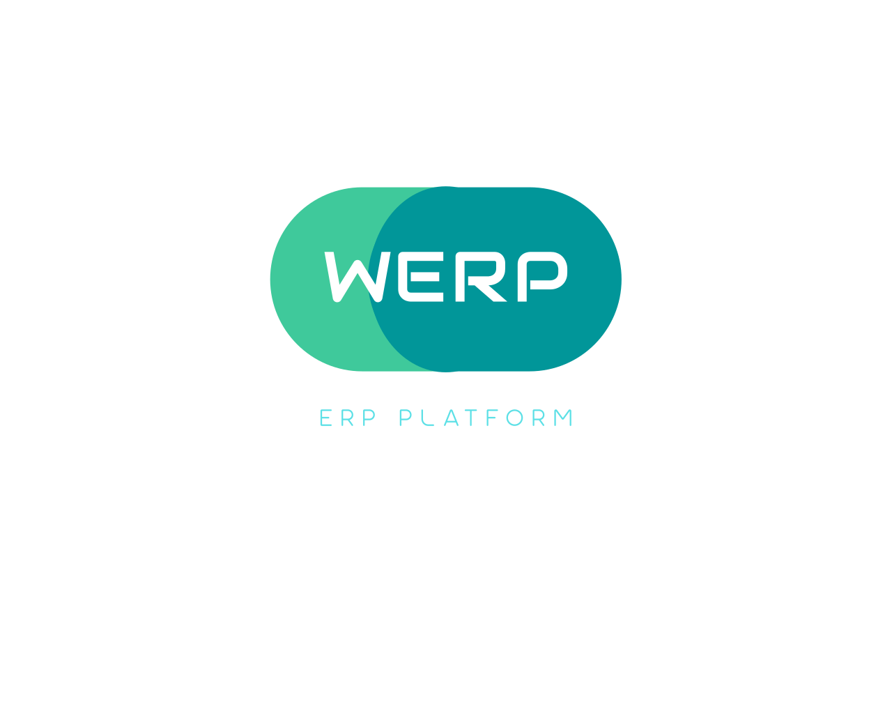

<div align="center">
  
</div>

# Werkflow-ERP — Standalone Business Domain Service

A pure **CRUD data service** for HR, Finance, Procurement, and Inventory domains. Designed to be deployed independently or integrated with the [Werkflow](https://github.com/themaverik/werkflow) workflow orchestration platform.

> **What is this?** Werkflow-ERP manages business domain data. Workflow orchestration, approvals, and routing logic live in the main Werkflow platform.

---

## Quick Facts

| Property | Value |
|----------|-------|
| **Type** | Spring Boot microservice (Java 21) |
| **Port** | 8084 |
| **Context Path** | `/api/v1` |
| **Database** | PostgreSQL 5433 (4 schemas: hr_service, finance_service, procurement_service, inventory_service) |
| **Authentication** | OIDC JWT (Keycloak, Auth0, Azure AD, AWS Cognito) |
| **Multi-Tenancy** | Yes (required from Day 1) |
| **Optional Deployment** | Can run standalone or as part of werkflow stack |

---

## What This Service Does

✅ **Provides CRUD APIs for:**
- **HR**: Employees, departments, leave, attendance, payroll, performance reviews
- **Finance**: Budget plans, expenses, approval thresholds
- **Procurement**: Vendors, purchase requests, orders, receipts
- **Inventory**: Assets, categories, custody, transfers, maintenance

✅ **Validates:**
- Foreign key constraints (within and across domains)
- Enum values (status fields)
- Required fields and data types
- Idempotency for safe retries

❌ **Does NOT provide:**
- Business approval workflows (use werkflow orchestration)
- Budget checks before purchasing (use werkflow business logic)
- Task assignment or routing (use werkflow Engine)
- Notifications or messaging (use werkflow actions)

---

## Architecture: Two-Service Model

```
┌─────────────────────────┐
│  werkflow Platform      │
│  (Main Service)         │
├─────────────────────────┤
│  Engine (8081)          │  BPMN Orchestration
│  - Workflow execution   │  Approval routing
│  - Business logic       │  Task assignment
│  - Approval checks      │
├─────────────────────────┤
│  Admin (8083)           │  Platform Users
│  - Keycloak sync        │  Departments
│  - Service registry     │  Roles
├─────────────────────────┤
│  Portal (4000)          │  Designer / Dashboard
│  - Form builder         │  Task management
│  - BPMN designer        │
└─────────────────────────┘
           ↓ (REST API calls via ExternalApiCallDelegate)
           ↓ (authenticated with JWT + tenant ID)
           ↓
┌─────────────────────────┐
│  werkflow-erp           │
│  (This Service)         │
├─────────────────────────┤
│  Business Service (8084)│  Pure Data Layer
│  - HR APIs              │  CRUD + Validation
│  - Finance APIs         │  No orchestration
│  - Procurement APIs     │  No approvals
│  - Inventory APIs       │  No business logic
├─────────────────────────┤
│  PostgreSQL             │
│  (shared or isolated)   │
└─────────────────────────┘
```

### Key Contract

**werkflow** orchestrates business workflow:
- "If budget approved AND manager signed off → create purchase order"

**werkflow-erp** stores and validates data:
- "Store this purchase request. Valid? Yes → 201 Created. Invalid? No → 400 Bad Request"

---

## Prerequisites

- **Docker & Docker Compose** — for running database and auth
- **Java 21+** — for local development
- **Maven 3.8+** — for building

### Shared Services (from main werkflow)

werkflow-erp connects to these services (all must be running):

| Service | URL | Purpose |
|---------|-----|---------|
| PostgreSQL | localhost:5433 | Data persistence |
| Keycloak | localhost:8090 | JWT token validation |

To start shared services:

```bash
cd ../werkflow/infrastructure/docker
docker compose up -d postgres keycloak mailpit
```

---

## Quick Start

### 1. Build

```bash
mvn clean install -DskipTests
```

### 2. Run

```bash
# Option A: Docker Compose
docker compose up -d

# Option B: Local (requires PostgreSQL + Keycloak running)
mvn spring-boot:run
```

### 3. Verify

```bash
curl -s http://localhost:8084/api/v1/actuator/health | jq .
```

Expected response:
```json
{
  "status": "UP",
  "components": {
    "db": { "status": "UP" },
    "diskSpace": { "status": "UP" },
    "livenessState": { "status": "UP" },
    "readinessState": { "status": "UP" }
  }
}
```

### 4. Access Swagger UI

```
http://localhost:8084/api/v1/swagger-ui.html
```

**Authenticate** via the "Authorize" button with Keycloak credentials:

| User | Password | Role |
|------|----------|------|
| admin | admin123 | ADMIN |
| employee | employee123 | EMPLOYEE |

---

## API Overview

All endpoints require authentication (`Authorization: Bearer <JWT>`).

### HR APIs

```
GET     /api/v1/hr/employees
GET     /api/v1/hr/employees/{id}
POST    /api/v1/hr/employees
PUT     /api/v1/hr/employees/{id}
DELETE  /api/v1/hr/employees/{id}

GET     /api/v1/hr/departments
POST    /api/v1/hr/departments

GET     /api/v1/hr/leaves
POST    /api/v1/hr/leaves
PUT     /api/v1/hr/leaves/{id}/approve
PUT     /api/v1/hr/leaves/{id}/reject
```

### Finance APIs

```
GET     /api/v1/finance/budgets
POST    /api/v1/finance/budgets

GET     /api/v1/finance/budget-categories
POST    /api/v1/finance/budget-categories

GET     /api/v1/finance/expenses
POST    /api/v1/finance/expenses

POST    /api/v1/finance/budget-check
  Body: { departmentId, amount, fiscalYear }
  Response: { available, availableAmount, reason }
```

### Procurement APIs

```
GET     /api/v1/procurement/vendors
POST    /api/v1/procurement/vendors

GET     /api/v1/procurement/purchase-requests
POST    /api/v1/procurement/purchase-requests

GET     /api/v1/procurement/purchase-orders
POST    /api/v1/procurement/purchase-orders

GET     /api/v1/procurement/receipts
POST    /api/v1/procurement/receipts
```

### Inventory APIs

```
GET     /api/v1/inventory/asset-categories
GET     /api/v1/inventory/asset-definitions
POST    /api/v1/inventory/asset-instances

GET     /api/v1/inventory/asset-requests
POST    /api/v1/inventory/asset-requests
POST    /api/v1/inventory/asset-requests/{id}/process-instance
POST    /api/v1/inventory/asset-requests/callback/approve
POST    /api/v1/inventory/asset-requests/callback/reject
POST    /api/v1/inventory/asset-requests/callback/procurement

GET     /api/v1/inventory/custody-records
POST    /api/v1/inventory/custody-records

GET     /api/v1/inventory/transfer-requests
POST    /api/v1/inventory/transfer-requests

GET     /api/v1/inventory/maintenance-records
POST    /api/v1/inventory/maintenance-records
```

### Metadata APIs

#### Enum Metadata Endpoint

Get metadata for all enums across the application. Useful for populating dropdowns, validating enum values, and understanding allowed status transitions.

```
GET     /api/v1/meta/enums
```

**Response Example**:

```json
{
  "enums": [
    {
      "name": "EmployeeStatus",
      "description": "Represents the employment status of an employee",
      "values": [
        {
          "value": "ACTIVE",
          "label": "Active",
          "description": "Employee is actively employed"
        },
        {
          "value": "ON_LEAVE",
          "label": "On Leave",
          "description": "Employee is currently on leave"
        },
        {
          "value": "SUSPENDED",
          "label": "Suspended",
          "description": "Employee employment is suspended"
        },
        {
          "value": "TERMINATED",
          "label": "Terminated",
          "description": "Employee has been terminated"
        }
      ]
    },
    {
      "name": "LeaveType",
      "description": "Represents different types of leave available to employees",
      "values": [
        {
          "value": "ANNUAL",
          "label": "Annual Leave",
          "description": "Annual paid leave"
        },
        {
          "value": "SICK",
          "label": "Sick Leave",
          "description": "Leave taken when employee is sick"
        }
      ]
    }
  ]
}
```

**Enums Exposed by Domain**:

- **HR** (4 enums): EmployeeStatus, LeaveType, AttendanceStatus, PerformanceRating
- **Finance** (2 enums): BudgetStatus, ExpenseStatus
- **Procurement** (4 enums): PrStatus, PoStatus, ReceiptStatus, VendorStatus
- **Inventory** (5 enums): AssetRequestStatus, AssetCondition, AssetStatus, TransferStatus, MaintenanceType

**Use Cases**:

- Populate dropdown lists in UI forms
- Validate user-submitted enum values before API calls
- Display human-readable labels and descriptions in UI
- Generate form documentation
- Enable intelligent error messages ("Status must be one of: DRAFT, PENDING, APPROVED, ...")

**Authentication**: This endpoint requires valid JWT authentication (like all other APIs).

---

## User Identity Architecture

werkflow-erp implements OIDC-compliant user identity management per ADR-002.

### Design Principles

- **JWT Minimization**: Tokens contain only authorization claims (`sub`, `roles`, `tenant_id`)
- **PII Protection**: Names and email never in JWT or logs (GDPR/CCPA compliant)
- **Scalable Caching**: User profiles cached locally with Caffeine (TTL 5-15 min)
- **Provider Agnostic**: Works with Keycloak, Auth0, Azure AD, or any OIDC provider

### User Profile Resolution

1. User authenticates with OIDC provider — JWT issued
2. werkflow-erp validates JWT, extracts `sub` claim
3. UserInfoResolver calls provider's `/userinfo` endpoint
4. Profile (name, email) cached locally in `users` table
5. All API responses include `createdByDisplayName` / `updatedByDisplayName`

### Configuration

Add to `application.yml`:

```yaml
werkflow:
  security:
    roles-claim: roles  # Keycloak, Azure AD (default)
    # roles-claim: scope        # Auth0
    # roles-claim: permissions  # Custom providers
```

Or via environment variable: `WERKFLOW_SECURITY_ROLES_CLAIM`

### Supported Auth Providers

| Provider | JWT Issuer URL | Roles Claim | Tested |
|---|---|---|---|
| Keycloak | `https://keycloak.../realms/werkflow` | `roles` | Yes |
| Auth0 | `https://tenant.auth0.com/` | `scope` | Yes |
| Azure AD | `https://login.microsoftonline.com/.../oauth2/v2.0` | `roles` | Yes |
| AWS Cognito | `https://cognito-idp.../.../ ` | `roles` | Yes |

### Security and Compliance

- **No PII in JWT**: `sub`, `roles`, `tenant_id` only
- **GDPR compliant**: Names cached locally, no email in logs
- **Cache TTL**: 5-15 minutes (default 10 min) for name refresh
- **Graceful degradation**: If `/userinfo` unavailable, falls back to opaque `sub`

---

## Key Features

### Multi-Tenancy

Every operation is scoped to a tenant. Tenant ID comes from:

1. **JWT claim** (preferred): `organization_id` in token claims
2. **Header** (fallback): `X-Tenant-ID` header

Example request:

```bash
curl -X GET http://localhost:8084/api/v1/inventory/asset-instances \
  -H "Authorization: Bearer eyJhbGc..." \
  -H "X-Tenant-ID: acme-corp"
```

**No cross-tenant data leaks**: Queries automatically filter by tenant ID.

### Idempotency for Safe Retries

When creating resources, provide an `X-Idempotency-Key` header:

```bash
curl -X POST http://localhost:8084/api/v1/procurement/purchase-requests \
  -H "Authorization: Bearer eyJhbGc..." \
  -H "X-Idempotency-Key: 550e8400-e29b-41d4-a716-446655440000" \
  -H "Content-Type: application/json" \
  -d '{ "requestingDeptId": 42, "priority": "HIGH" }'
```

If werkflow retries with the same key:
- **First call**: `201 Created` with response body
- **Retry**: `200 OK` with same response body (not duplicated)

TTL: 24 hours

### Pagination

All list endpoints support pagination:

```bash
GET /api/v1/hr/employees?page=0&size=20&sort=createdAt,desc
```

Response:

```json
{
  "content": [ { ... }, { ... } ],
  "pageable": {
    "pageNumber": 0,
    "pageSize": 20,
    "totalElements": 1250,
    "totalPages": 63
  }
}
```

### DTO Examples in Swagger/OpenAPI

All Request and Response DTOs include comprehensive `@Schema` examples that are automatically exposed in the Swagger UI. These examples show:

- **Complete JSON structures** with all fields
- **Realistic data values** (IDs, dates, amounts, etc.)
- **Nested objects** (e.g., PurchaseRequest with LineItems)
- **Enum values** (Status fields showing allowed values)
- **Optional vs. required fields**

**Access examples**:

1. Open Swagger UI: `http://localhost:8084/api/v1/swagger-ui.html`
2. Click any endpoint to expand it
3. Under "Request body" or "Responses", click the DTO name to see the example JSON
4. Use the example to understand the expected structure before making API calls

**Example domains with rich documentation**:

- **HR**: LeaveRequest, LeaveResponse — employee leave approval flows
- **Finance**: ExpenseRequest, ExpenseResponse — expense claim workflows
- **Procurement**: PurchaseRequestRequest, PurchaseRequestResponse — purchase order flows with line items
- **Inventory**: AssetInstanceResponse, TransferRequestRequest/Response — asset management workflows

---

## Deployment

**Standalone:**
```bash
docker compose up -d
```

**Integrated with werkflow stack:**
```bash
cd ../werkflow/infrastructure/docker
docker compose -f docker-compose.yml -f docker-compose.business.yml up -d
```

**Local Development:**
```bash
# Start shared services
cd ../werkflow/infrastructure/docker
docker compose up -d postgres keycloak

# Run service
cd <this repo>
mvn spring-boot:run
```

---

## Configuration

Environment variables in `config/env/`:

| File | Purpose |
|------|---------|
| `.env.shared` | Database, Keycloak URLs (shared across services) |
| `.env.business` | Business service specifics (port, log level, etc.) |

### Required Environment Variables

```bash
# Database
POSTGRES_HOST=localhost
POSTGRES_PORT=5433
POSTGRES_DB=werkflow
POSTGRES_USER=werkflow_admin
POSTGRES_PASSWORD=secure_password_change_me

# OIDC Provider (Keycloak default; swap for Auth0, Azure AD, etc.)
KEYCLOAK_URL=http://localhost:8090
KEYCLOAK_REALM=werkflow
KEYCLOAK_REALM_PUBLIC_KEY=...

# Service
SERVER_PORT=8084
LOG_LEVEL=INFO
```

---

## Integration with werkflow

For detailed integration instructions, see **[Integration Guide](./docs/WERKFLOW-INTEGRATION-GUIDE.md)** which covers:
- Connector registration in werkflow Admin Portal
- BPMN workflow setup and examples
- Header configuration (tenant ID, idempotency keys)
- Error handling patterns

---

## Error Handling

All errors follow a consistent format:

```json
{
  "code": "VALIDATION_ERROR",
  "message": "Invalid budget category",
  "timestamp": "2026-04-06T10:30:00Z",
  "details": {
    "fieldName": "budgetCategoryId",
    "reason": "Category not found: 999"
  }
}
```

### Common HTTP Status Codes

| Code | Meaning | Example |
|------|---------|---------|
| `200 OK` | Success (idempotent retry) | Duplicate POST with same Idempotency-Key |
| `201 Created` | Resource created | POST to create employee |
| `400 Bad Request` | Validation failed | Missing required field |
| `401 Unauthorized` | JWT invalid/expired | No Authorization header |
| `403 Forbidden` | Cross-tenant access | Querying another tenant's data |
| `404 Not Found` | Resource doesn't exist | GET /employees/99999 |
| `409 Conflict` | Data conflict | Foreign key violation |
| `500 Internal Error` | Server error | Database connection failed |

---

## Development

### Running Tests

```bash
# All tests
mvn test

# Single test class
mvn test -Dtest=AssetRequestServiceTest

# Integration tests only
mvn test -Dgroups=integration
```

### Code Standards

- **Java version**: 21
- **Spring Boot**: 3.3.2
- **Formatting**: Google Java Style Guide
- **Imports**: No wildcard imports
- **Nullability**: Use `@Nullable` where applicable

### Building for Production

```bash
mvn clean package -P prod -DskipTests
```

Creates `services/business/target/business-service.jar`

---

## Database Migrations

Migrations are managed by Flyway. Located at:

```
services/business/src/main/resources/db/migration/
```

Format: `V{n}__{description}.sql`

To add a migration:

1. Create new file: `V24__add_tenant_column.sql`
2. Write SQL
3. Commit to Git
4. On startup, Flyway applies it automatically

---

## Troubleshooting

### "401 Unauthorized"

**Cause**: JWT token missing or invalid

**Fix**:
```bash
# Get token from Keycloak
TOKEN=$(curl -s -X POST http://localhost:8090/realms/werkflow/protocol/openid-connect/token \
  -H "Content-Type: application/x-www-form-urlencoded" \
  -d "client_id=werkflow-api&client_secret=secret&grant_type=client_credentials" \
  | jq -r '.access_token')

# Use in request
curl -H "Authorization: Bearer $TOKEN" http://localhost:8084/api/v1/actuator/health
```

### "Connection refused: localhost:5433"

**Cause**: PostgreSQL not running

**Fix**:
```bash
# Check if running
docker ps | grep postgres

# Start it
docker compose up -d postgres
```

### "403 Forbidden - Cross-tenant access"

**Cause**: Your JWT doesn't match the `X-Tenant-ID` header

**Fix**: Ensure your JWT `organization_id` claim matches the tenant ID in your request.

---

## Documentation

### Guides
- **[API Usage Guide](./docs/API-USAGE-GUIDE.md)** — Step-by-step examples for all 4 domains (HR, Finance, Procurement, Inventory)
- **[Integration Guide](./docs/WERKFLOW-INTEGRATION-GUIDE.md)** — Connector setup and BPMN workflow examples

### Reference
- **[Architecture Decisions](./docs/ADR-001-Service-Boundary-Architecture.md)** — Design rationale
- **[Implementation Roadmap](./ROADMAP.md)** — What's being built next
- **[Business Flow Diagrams](./FLOW_DIAGRAMS.md)** — Visual workflows (informational)

---

## License

Proprietary — All rights reserved

---

## Support

For issues, questions, or feature requests:

1. Check the [Architecture Decision Records](./docs/)
2. Review the [ROADMAP](./ROADMAP.md) for planned features
3. File an issue on GitHub
4. Contact the Tech Lead

