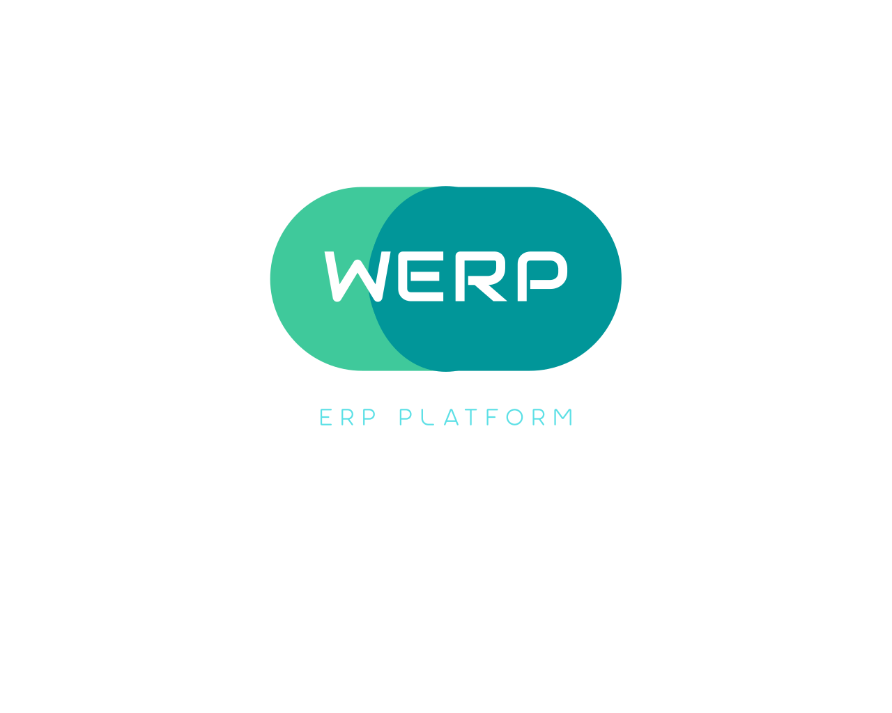

<div align="center">
  
</div>

# Werkflow-ERP

A standalone CRUD data service for HR, Finance, Procurement, and Inventory domains. Designed for independent deployment or integration with the [Werkflow](https://github.com/themaverik/werkflow) workflow orchestration platform.

| Property | Value |
|---|---|
| Type | Spring Boot microservice (Java 21) |
| Port | 8084 |
| Context Path | `/api/v1` |
| Database | PostgreSQL 5433 |
| Authentication | OIDC JWT (Keycloak, Auth0, Azure AD, AWS Cognito) or API Key (`X-API-Key`) |
| Multi-Tenancy | Yes |

---

## What This Service Does

Provides CRUD APIs for five domains:

- **HR**: Employees, departments, leave, attendance, payroll, performance reviews
- **Finance**: Budget plans, expenses, approval thresholds
- **Procurement**: Vendors, purchase requests, orders, receipts
- **Inventory**: Assets, categories, custody, transfers, maintenance
- **Identity**: User profile cache (OIDC), custody-owner-to-candidate-group mappings (ADR-004)

Validates data (enum values, required fields) and enforces idempotency for safe retries. Does not implement business approval logic, notifications, or workflow routing — those belong to the caller.

---

## Prerequisites

- Docker and Docker Compose
- Java 21+
- Maven 3.8+

Shared services (must be running):

```bash
cd ../werkflow/infrastructure/docker
docker compose up -d postgres keycloak mailpit
```

---

## Quick Start

```bash
# Build
mvn clean install -DskipTests

# Run (Docker Compose)
docker compose up -d

# Verify
curl -s http://localhost:8084/api/v1/actuator/health | jq .

# Swagger UI
open http://localhost:8084/api/v1/swagger-ui.html
```

---

## Configuration

Environment variables in `config/env/`:

| File | Purpose |
|---|---|
| `.env.shared` | Database, Keycloak URLs |
| `.env.business` | Service port, log level |

Key variables: `POSTGRES_HOST`, `POSTGRES_PORT`, `KEYCLOAK_URL`, `KEYCLOAK_REALM`, `SERVER_PORT`.

---

## API Key Authentication

Requests may authenticate with `X-API-Key: <raw-key>` instead of a Bearer token. The key is validated against a SHA-256 hash stored in the `api_keys` table — raw keys are never persisted.

**Register a key via API (preferred):**

`POST /api/v1/api-keys/generate` — requires `ADMIN`, `SUPER_ADMIN`, or `ENGINE_SERVICE` role.

```json
{ "name": "werkflow-enterprise", "tenantId": "default" }
```

Returns `{ "rawKey": "...", "id": "...", "name": "...", "tenantId": "...", "createdAt": "..." }`. Store the `rawKey` securely (OpenBao) — it is not stored and cannot be retrieved again.

**Register a key manually:**

1. Connect to the ERP Postgres container:

```bash
docker exec -it werkflow-postgres psql -U werkflow_admin -d werkflow
```

2. Insert the key (Postgres computes the SHA-256 hash — the raw key is never stored):

```sql
INSERT INTO api_keys (key_hash, tenant_id, name)
VALUES (encode(sha256('your-raw-key'::bytea), 'hex'), 'default', 'werkflow-enterprise');
```

Replace `'your-raw-key'` with the actual secret, `'default'` with the target tenant code, and `'werkflow-enterprise'` with a descriptive label.

3. Use the raw key in requests:

```http
X-API-Key: your-raw-key
```

**Using API Key in Swagger UI:**

Open `http://localhost:8084/api/v1/swagger-ui/index.html`, click **Authorize**, select the `apiKey` scheme, and paste the raw key.

**Revoke a key:**

```sql
UPDATE api_keys SET active = false WHERE name = 'werkflow-enterprise';
```

**Set an expiry:**

```sql
UPDATE api_keys SET expires_at = '2027-01-01T00:00:00Z' WHERE name = 'werkflow-enterprise';
```

---

## Documentation

| Document | Description |
|---|---|
| [docs/Architecture-Overview.md](./docs/Architecture-Overview.md) | Architecture, design principles, and business flow diagrams |
| [docs/API-Usage-Guide.md](./docs/API-Usage-Guide.md) | Step-by-step API examples for all four domains |
| [docs/Werkflow-Integration-Guide.md](./docs/Werkflow-Integration-Guide.md) | Connector setup, BPMN workflow examples, ProcessInstanceId linking |
| [docs/Independence-Checklist.md](./docs/Independence-Checklist.md) | PR review checklist and anti-pattern guide |
| [docs/adr/ADR-001-Service-Boundary-Architecture.md](./docs/adr/ADR-001-Service-Boundary-Architecture.md) | Service boundary and independence decisions |
| [docs/adr/ADR-002-User-Identity-And-JWT-Claims.md](./docs/adr/ADR-002-User-Identity-And-JWT-Claims.md) | User identity and JWT claims design |
| [Roadmap.md](./Roadmap.md) | Implementation roadmap and task tracking |

---

## License

Proprietary — All rights reserved
